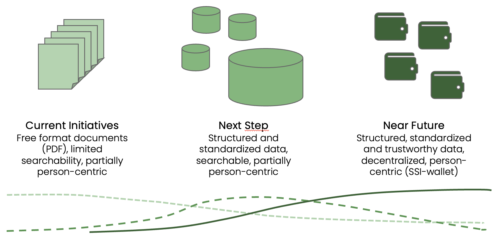

https://www.youtube.com/watch?v=uNrMFE2wOyQ

# Digital Health with the new E-ID trust infrastructure

## Using verifiable credentials for trustworthy structured healthcare data

Generated with Dall-E 3, prompt «person-centric wallet-based structured healthcare data»

# Challenge

This challenge aims to implement a proof of concept (PoC) use case with healthcare data as a showcase, based on the SSI trust infrastructure of the new Swiss E-ID.

The advantage of the trust infrastructure over current centralized approaches is the person-centered, secure and trustworthy storage of health data in the personal digital wallet (see [DIDAS Statement for E-ID Technology Discussion Paper](https://www.didas.swiss/2024/02/21/4478/)).

This means that the data remains with the citizen and cannot be viewed by third parties without their consent. The technology of the trust infrastructure makes it possible to focus on specialist topics.

This challenge offers interested participants the opportunity to familiarize themselves early on with concepts and technologies that form the basis for E-IDs and many other secure applications and for which there is increasing demand.

## Resources

[Switzerland's new e-ID](https://www.ejpd.admin.ch/bj/de/home/staat/gesetzgebung/staatliche-e-id.html) is based on the principles of [Self Sovereign Identity](https://en.wikipedia.org/wiki/Self-sovereign_identity#:%7E:text=Self%2Dsovereign%20identity%20(SSI),and%20applications%20across%20the%20web.) (SSI) and is scheduled for introduction in 2026. An ecosystem with a trust infrastructure is currently being set up for the E-ID. The possibilities of this ecosystem go far beyond the E-ID – principles and technology can be used in various sectors such as healthcare, finance, mobility, logistics, etc. An [E-ID Sandbox](https://github.com/e-id-admin/public-sandbox-trustinfrastructure) is available to gather practical experience as early as possible.

The [DIDAS](https://www.didas.swiss/) association is committed to promoting SSI principles and implementation in Switzerland. Topics from the various sectors are dealt with in [working groups](https://www.didas.swiss/working-groups/).
 

Generated with Dall-E 3, prompt «digital patient check-in to doctor's office reception desk with QR-code»

The [use case](https://github.com/janesp/health-ssi) for this challenge is a doctor's appointment using the possibilities of the trust infrastructure:

* The patient John Miller has a digital wallet with information about his health data (allergies, medication, etc.) as well as an insurance card in the form of previously issued verifiable credentials.
* John enters Dr. Charles Brewster's office and checks in using a QR code; this triggers a request for insurance and health information in John's wallet (proof request), which John confirms.
* During the consultation, Dr. Brewster issues the results of his examination as verifiable credentials and prescribes some drugs, also in the form of verifiable credentials.
* After the visit, John orders the drugs via the online store «Universal Pharmacy», presenting the prescription as verifiable credentials.

For this challenge, an environment similar to the E-ID Sandbox is available for rapid prototyping. The [Verifiable Credential Management System](https://github.com/SSI-Solutions/vcms/tree/main) (VCMS) is used as an abstraction of the current E-ID Sandbox technology. International standards are used for medical information in the interests of interoperability:

* [FHIR](http://www.hl7.org/fhir/), part of the [HL7](http://www.hl7.org/) standards
* [FHIR.ch](http://www.fhir.ch/), Swiss specifics
* [International Patient Summary](https://international-patient-summary.net/) (IPS)
* [openEHR](https://openehr.org/)
* [SNOMED CT](https://www.snomed.org/)

There are also interesting podcasts and webinars on topics relating to digital transformation in the healthcare sector:

* [Marktplatz Gesundheitswesen](https://gesundheitswesen.org/) (CH, German) – ZHAW, Prof. Dr. Alfred Angerer
* [eHealth Podcast](https://www.ehealth-podcast.de/) (DE, German) – DER Podcast rund um Gesundheits- und Medizininformatik, Hochschulen Konstanz und Niederrhein
* [e-Health Pioneers Podcast](https://themedicalnetwork.de/podcast/) (DE, German) – The Medical Network, Andrea Buzzi
* [DIDAS Health Webinars](https://www.youtube.com/playlist?list=PLDiii1ZjtiLbqqg1OYZ8dakz6yLpitenf) (CH/EU, English) – Recordings of guest presenters

Frameworks can be used for the technical implementation in the sense of rapid prototyping, e.g.

* [strapi](https://strapi.io/) – modern «headless» CMS
* [Drupal](https://www.drupal.org/) – powerful CMS (with a steep learning curve), supports «headless»
* [Svelte](https://svelte.dev/), [SvelteKit](https://kit.svelte.dev/) – components and framework for web apps
* [Verifiable Credentials Playground](https://vcplayground.org/), incl. [chapi](https://chapi.io/) documentation
* ...

## Goal

In this challenge, the use case with the personal health shall be implemented as a «showcase» PoC, based on the SSI trust infrastructure of the new Swiss E-ID.

To this end, prototypes of the individual components shall be developed and configured:

* Wallet of the patient John Miller, prepared verifiable credentials for insurance card and allergies (holder and verifier role)
* Relevant elements of Dr. Brewster's practice information system
* Allergies from IPS (verifier role)
* Medical history, diagnosis, medication for the creation of verifiable credentials (issuer role)
* Relevant elements of the mail-order pharmacy «Universal Pharmacy» (verifier role)

Schemas for the required verifiable credentials are defined for implementation based on international standards. The relevant data objects are stored and visualized with the front end of the prototypes, and part of the back end uses them to create the respective verifiable credentials via VCMS calls.

## Outcomes

The SSI Health PoC Showcase serves to demonstrate to healthcare and technical stakeholders in 2024 how SSI principles and the trust infrastructure can be used for structured and trustworthy healthcare data.

Based on this growing awareness, the aim is to demonstrate use cases based with the introduction of the E-ID in 2026 and, if necessary, to offer them already.

In addition to the envisaged documentation, it is planned to create a short video of the result of the hackathon (e.g. as for the [OnceHealth PoC](https://youtu.be/T5bYmy_oXMo)), which can be shown to interested stakeholders.

## Solutions

There are a number of initiatives for digital transformation in the healthcare sector, albeit with limited success to date; some of these are listed below as examples:

* [Electronic patient record](https://www.patientrecord.ch/individuals) (EPR) – based on unstructured PDF documents, costs of several 100 M CHF over the last 10 years, currently around 20,000 opened dossiers
* [Well](https://www.well.ch/en/) – offered by health insurance companies, no integration of the EPR
* [Compassana](https://www.compassana.ch/en) – offered by health insurance companies, no integration of the EPR
* HealthLink – initiative of the former axsana
* OnceHealth – [prototype](https://youtu.be/T5bYmy_oXMo), [positioning](https://drive.google.com/drive/folders/1rjdld14PXWpas2VALUmgrYFgNeRXBS0B)
* openEHR PoC and request for proposal of the University Hospital Basel
* [openEHR.ch](https://openehr.ch/) – Swiss association as Swiss branch of the global organization openEHR.org
* [Cobedias](https://www.cobedix.ch/en) – structured recording of health data for registered doctors
* [Swiss Health Data Space](https://gesundheitsdatenraum.ch/en/)
* [HIN SSI Proof of Concept](https://youtu.be/PTWGwz9Sd7U) for medical practice licenses (BAB)
* ...

The majority of these initiatives aim for structured health data, but none of them except the HIN SSI PoC are based on SSI principles.

## Restrictions

SSI technologies are not yet fully ready for productive use, many aspects are still emerging.

The technology of the E-ID planned for 2026 has not yet been decided (see [DIDAS Statement for E-ID Technology Discussion Paper](https://www.didas.swiss/2024/02/21/4478/)).

The current E-ID sandbox will be migrated to this new technology based on the E-ID technology decision expected shortly (Sandbox 2.0). It is planned to migrate VCMS to this new technology as well.

## Usage

The «showcase» PoC of this specific use case is intended to achieve several objectives by demonstrating specific possibilities:

* Feasibility of using the trust infrastructure and verifiable credentials for structured and trusted healthcare data
* Interaction between various stakeholders such as citizens, medical doctors and pharmacies in the trust infrastructure ecosystem
* Specific healthcare use case as a demonstrator of the DIDAS Health working group
* Specific healthcare (non-technical) use case for the SSI community, e.g. presentation at [DICE 2024](https://diceurope.org/)
* Improving semantic interoperability of structured and standardized health data for the benefit of citizens and service providers

Possible further development of the current health data infrastructure to increase awareness among representatives of the healthcare sector (see also [DIDAS statement on the EPDG consultation](https://www.didas.swiss/2023/11/13/didas-statement-on-the-epdg-revision/)) – better and secure data exchange, less paper, less copying, faster processes, better treatments, fewer complications, less administration

## Organization

* Abdagon AG, Dr. Peter Janes, Founder and CEO; DIDAS Health Lead
* Adnovum AG, Dr. Roman Zoun, Head Security Solutions Offerings; DIDAS Adoption Lead
* DIDAS

## Further information

* Breaking News 29.02.2024, European Parliament adopts eIDAS 2.0 – [MEPs back plans for an EU-wide digital wallet](https://www.europarl.europa.eu/news/en/press-room/20240223IPR18095/meps-back-plans-for-an-eu-wide-digital-wallet)
* [EU Health Data Space must be individual-centric to benefit all stakeholders](https://mydata.org/2023/12/13/eu-health-data-space-must-be-individual-centric-to-benefit-all-stakeholders/)
* [EU Digital Identity Wallet](https://ec.europa.eu/digital-building-blocks/sites/display/EUDIGITALIDENTITYWALLET/EU+Digital+Identity+Wallet+Home)
* …

# \*\*\*\*\*\*\*\*\*\*\*\*

# Project Documentation

We are international 😊. We have supporters with a variety of backgrounds, therefore our documentation is in English.

## Project Team

* [Peter Janes](https://www.linkedin.com/in/peterjanes/), Abdagon AG, Founder and CEO (peter.janes@abdagon.com); DIDAS Health Lead - Challenge Owner
* [Florian Bürgi](https://www.linkedin.com/in/florian-b%C3%BCrgi-7224b449/) \- wallet loader
* [Gian Derungs](https://www.linkedin.com/in/gian-valentin-derungs-482358176/) \- schemas\, proof request
* [Raphael Guye](https://www.linkedin.com/in/raphaelguye/) \- doctor's platform
* [Richard Lagrange](https://www.linkedin.com/in/richard-lagrange/) \- Azure environment
* [Bryan Raymonenq](https://www.linkedin.com/in/bryan-reymonenq/) \- patient
* [Lars Ruddigkeit](https://www.linkedin.com/in/drlr1/)

Please note that we are aiming to produce a short video about the activities of our challenge team. Let us know if you don't want to appear on images.

## Supporters

* [Roman Zoun](https://www.linkedin.com/in/roman-zoun/), Adnovum AG, Head Security Solutions Offerings; DIDAS Adoption Lead - Challenge Co-Owner
* [Daniel Hegedues](https://www.linkedin.com/in/daniel-hegedus-025916170/), Adnovum AG, Senior Software Engineer - VCMS Supporter, remote
* [Timothy Rabozzi](https://www.linkedin.com/in/rabozzi/), Adnovum AG, Innovation Developer - on-site
* [Jan Carlos Janke](https://www.linkedin.com/in/jan-carlos-janke/), HSLU, Business Development Manager; DIDAS Community Manager - on-site 14.03.2024
* [Michel Sahli](https://www.linkedin.com/in/michelsahli/), Federal Office of Justice, E-ID Innovation Fellow
* ...

## Schema Mapping from FHIR (subsets)

[Logical schema](https://github.com/Abdagon/hackathon-2024-ssi-health/blob/main/health-ssi-schema.md) (with Entity-Relationship-Diagram)

* [patient](http://www.hl7.org/fhir/patient.html)
* [insuranceProof](http://fhir.ch/ig/ch-core/StructureDefinition-ch-core-patient.html)
* [allergyIntolerance](http://www.hl7.org/fhir/allergyintolerance.html)
* [practitioner](http://www.hl7.org/fhir/practitioner.html)
* [observation](http://www.hl7.org/fhir/observation.html)
* [medicationRequest](http://www.hl7.org/fhir/medicationrequest.html)

## Technical Environment

* Verifiable Credential Management System (VCMS)
    * [Documentation](https://github.com/SSI-Solutions/vcms/tree/main)
    * API Definitions (Swagger Format)
        * [Connector](https://vcms-int.westeurope.cloudapp.azure.com:9080/swagger-ui/index.html)
        * [Issuer](https://vcms-int.westeurope.cloudapp.azure.com:9081/swagger-ui/index.html) (run /issue/credentials/definitions for credential Anoncred schemas)
        * [Verifier](https://vcms-int.westeurope.cloudapp.azure.com:9084/swagger-ui/index.html)
* [GitHub Repository](https://github.com/Abdagon/hackathon-2024-ssi-health) (initial data model)
* [GitHub Repository](https://github.com/needToRoll/govTechHack24-ssi-health) (code)
* [Google Drive](https://drive.google.com/drive/folders/1eYZ7r8O8wqiZ7xaN8JV_eoUPMVM466Va) (Viewer, Editor requires invitation with Google Account)

## Executing the Project

### Discussing Options

### Desiging the Solution

### Defining the Schema

[Gian Derungs](https://www.linkedin.com/in/gian-valentin-derungs-482358176/)

### Loading the Wallet

[Florian Bürgi](https://www.linkedin.com/in/florian-b%C3%BCrgi-7224b449/)

### Building the Patient Wallet

[Bryan Raymonenq](https://www.linkedin.com/in/bryan-reymonenq/)

### Building the Doctor's Platform

[Raphael Guye](https://www.linkedin.com/in/raphaelguye/)

### Integrating the Components

10 PM - still hard at work - and having fun

## The Result

Stay tuned - more to follow shortly!

## Final Pitch and Prize

Winning the award in the future oriented category - handed over by [Federal Chancellor Viktor Rossi](https://www.bk.admin.ch/bk/de/home/bk/bundeskanzler.html):

Our phantastic team on stage for the award ceremony.

Our phantastic team - with [Federal Chancellor Viktor Rossi](https://www.bk.admin.ch/bk/de/home/bk/bundeskanzler.html) and [FOITT Director Dirk Lindemann](https://www.linkedin.com/in/dlindemann/).

## «Making of» Video

Showcasing team organization, work on the challenge and the final pitch with a live demonstration of the solution.

https://youtu.be/uNrMFE2wOyQ

## Positioning and Next steps

As correctly stated by jury member [Philippe Gillieron](https://www.linkedin.com/in/philippegillieron/), the challenge must be considered in the context of the current Swiss EPR initiative (EPD).

We anticipate a development of citizen oriented EHR information in three stages (see also [DIDAS statement on the EPDG consultation](https://www.didas.swiss/de/2023/11/13/didas-stellungnahme-zur-epdg-revision/)):

Anticipated transition stages

1. Document oriented («EPD 1.0») - current version, where information is mostly stored as reports in PDF-Format. A document oriented approach makes searches and automated processing alsmost impossible, which is particularly relevant with high volumes of documents.
2. Structured health information, server-based («EPD 2.0») - recognizing the limitations of document oriented information, there is wide agreement that clinical information must be available in structured and standardized formats to ensure semantic interoperability. Server-based technologies are readily available for such implementations.
3. Structured health information, wallet-based («EPD 3.0») - The very same standards can also be implemented based on SSI principles in the form of trustworthy «verifiable credentials» in digital wallets, which are part of the upcoming E-ID trust infrastructure.

There will certainly be extended transition periods and overlaps between the above stages, but the earlier we start prototyping, the sooner we can benefit from new possibilities.

The objective of our challenge was to demonstrate how a wallet-based healthcare use case can look like. We plan to further develop the prototype both on the use case and technology side. With this, we aim for further demonstrations to and feedback from the caregiver and citizens target groups.
