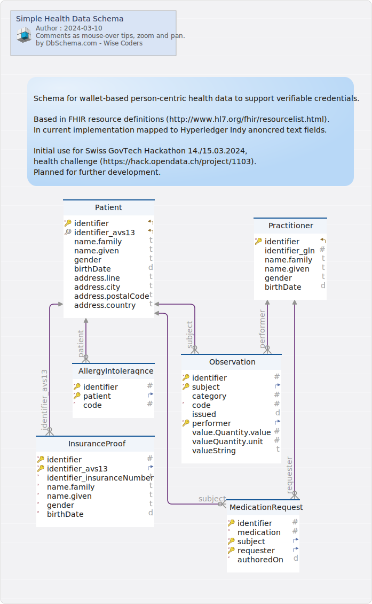

#Simple Health Data Schema
Generated using [DbSchema](https://dbschema.com)

### Simple Health Data Schema

### Entity INSTANCE.AllergyIntoleraqnce 
Subset of http://www.hl7.org/fhir/allergyintolerance.html

|Idx |Name |Data Type |
|---|---|---|
| * &#128273;  | identifier| INT  |
| * &#128273;  &#11016; | patient| INT  |
| * | code| INT  |

##### Relationships
|Type |Name |On |
|---|---|---|
| Vir | fk_AllergyIntoleraqnce_Patient | ( patient ) ref [INSTANCE.Patient](#Patient) (identifier) |

### Entity INSTANCE.InsuranceProof 
Special version of http://fhir.ch/ig/ch-core/StructureDefinition-ch-core-patient.html

|Idx |Name |Data Type |Description |
|---|---|---|---|
| * &#128273;  | identifier| INT  |  |
| * &#128273;  &#11016; | identifier\_avs13| VARCHAR(15)  |  |
| * | identifier\_insuranceNumber| VARCHAR(50)  |  |
| * | name.family| VARCHAR(80)  |  |
| * | name.given| VARCHAR(80)  |  |
| * | gender| VARCHAR(15)  | Values - male | female | other | unknown |
| * | birthDate| DATE  |  |

##### Relationships
|Type |Name |On |
|---|---|---|
| Vir | fk_InsuranceProof_Patient | ( identifier\_avs13 ) ref [INSTANCE.Patient](#Patient) (identifier\_avs13) |

### Entity INSTANCE.MedicationRequest 
Subset of http://www.hl7.org/fhir/medicationrequest.html

|Idx |Name |Data Type |Description |
|---|---|---|---|
| * &#128273;  | identifier| INT  |  |
| * | medication| INT  |  |
| * &#128273;  &#11016; | subject| INT  | Patient |
| * &#128273;  &#11016; | requester| INT  | Practitioner |
| * | authoredOn| DATE  |  |

##### Relationships
|Type |Name |On |
|---|---|---|
| Vir | fk_MedicationRequest_Patient | ( subject ) ref [INSTANCE.Patient](#Patient) (identifier) |
| Vir | fk_MedicationRequest_Practitioner | ( requester ) ref [INSTANCE.Practitioner](#Practitioner) (identifier) |

### Entity INSTANCE.Observation 
Subset of http://www.hl7.org/fhir/observation.html

Used for allergy instances in this example

|Idx |Name |Data Type |Description |
|---|---|---|---|
| * &#128273;  | identifier| INT  |  |
| * &#128273;  &#11016; | subject| INT  | Patient |
|  | category| INT  |  |
| * | code| INT  | Examples - weight | blood pressure | heart rate | .... |
|  | issued| DATE  |  |
| * &#128273;  &#11016; | performer| INT  |  |
|  | value.Quantity.value| INT  | Example 85 |
|  | valueQuantity.unit| INT  | Example kg |
|  | valueString| VARCHAR(100)  |  |

##### Relationships
|Type |Name |On |
|---|---|---|
| Vir | fk_Observation_Patient | ( subject ) ref [INSTANCE.Patient](#Patient) (identifier) |
| Vir | fk_Observation_Practitioner | ( performer ) ref [INSTANCE.Practitioner](#Practitioner) (identifier) |

### Entity INSTANCE.Patient 
Subset of http://www.hl7.org/fhir/patient.html

Should rather be «Person» based on the used subset.

|Idx |Name |Data Type |Description |
|---|---|---|---|
| * &#128273;  &#11019; | identifier| INT  |  |
| &#128269; &#11019; | identifier\_avs13| VARCHAR(15)  |  |
|  | name.family| VARCHAR(80)  |  |
|  | name.given| VARCHAR(80)  |  |
|  | gender| VARCHAR(15)  | Values - male | female | other | unknown |
|  | birthDate| DATE  |  |
|  | address.line| VARCHAR(100)  |  |
|  | address.city| VARCHAR(100)  |  |
|  | address.postalCode| VARCHAR(20)  |  |
|  | address.country| VARCHAR(50)  |  |

### Entity INSTANCE.Practitioner 
Subset of http://www.hl7.org/fhir/practitioner.html

|Idx |Name |Data Type |Description |
|---|---|---|---|
| * &#128273;  &#11019; | identifier| INT  |  |
|  | identifier\_gln| INT  |  |
|  | name.family| VARCHAR(100)  |  |
|  | name.given| VARCHAR(50)  |  |
|  | gender| VARCHAR(15)  | Values - male | female | other | unknown |
|  | birthDate| DATE  |  |

